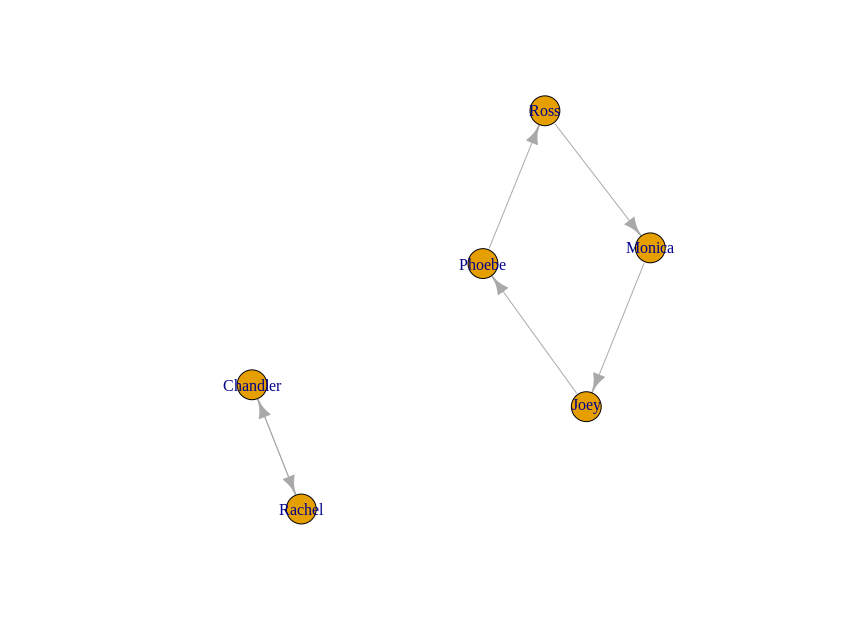

# Secret Santa

This is a simple script that can be used to create randomly assigned pairs for secret santa. The method ensures that nobody has
to gift themselves. It also contains code for plotting the gifting as a network and for sending every participant an Email to tell 
them who they are supposed to get a gift for.

